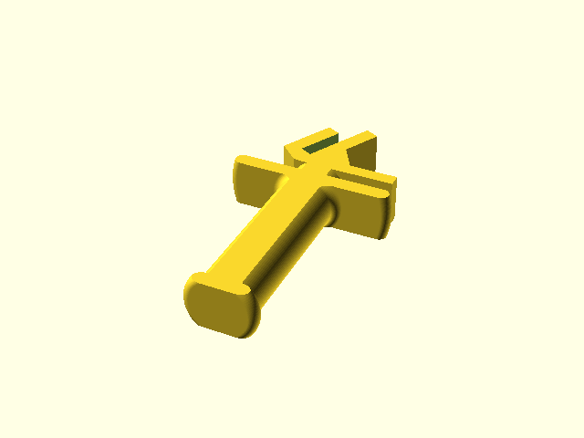

# openscad-prusa-i3-filament-holder

This is an OpenSCAD design for a filament spool holder and feeder for the Prusa i3. 

The holder can be used horizontally (facing the front) or diagonally (leaning back):

The feeder may be mirrored depending on which side you intend to mount the spool in, and may be a good place to mount a filament runout sensor.

